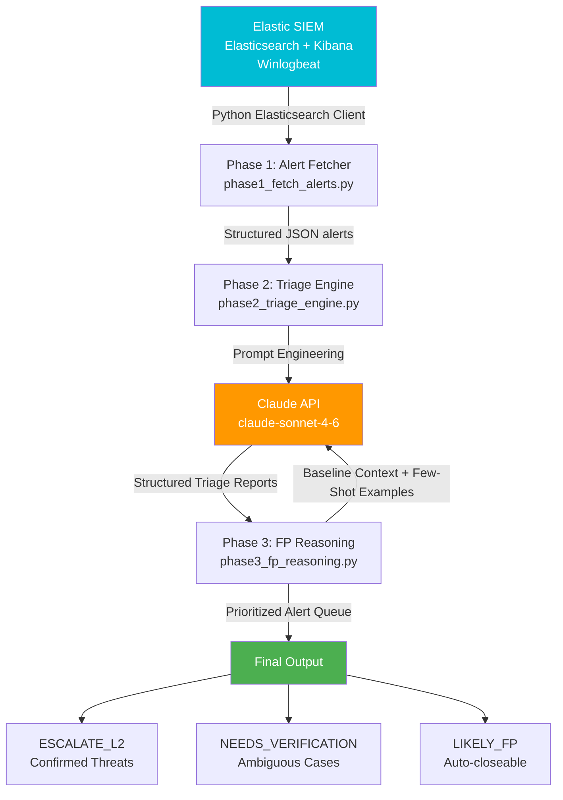

# AI-Augmented SOC Triage System

> Automating L1 security alert triage using Claude AI + Elastic SIEM

[](https://python.org)
[](https://anthropic.com)
[](https://attack.mitre.org)

---

## Overview

This project demonstrates an AI-assisted SOC (Security Operations Center) triage pipeline built on top of a Windows Security Event Log monitoring lab.

**Problem it solves:** In production SOC environments, 60-90% of alerts are false positives. L1 analysts spend most of their time on repetitive triage decisions that could be automated. This system uses Claude AI to perform the first-pass analysis, so analysts can focus on confirmed threats.

**Related project:** [SIEM Home Lab](https://github.com/ariancheng/siem-home-lab) — the Elastic Stack foundation this project builds on.

---

## Architecture



---

## Attack Scenarios Detected

Built on three MITRE ATT&CK use cases from the SIEM home lab:

| # | Attack Scenario | MITRE Technique | Event IDs | Detection Logic |
|---|----------------|-----------------|-----------|-----------------|
| 1 | SMB Network Reconnaissance | T1046 Network Service Discovery | 4625 | Failed auth during port scan |
| 2 | Brute Force Credential Attack | T1110 Brute Force | 4625, 4740 | Multiple failures + account lockout |
| 3 | Backdoor Account + Privilege Escalation | T1136, T1078 | 4720, 4732 | Account creation + group membership change |

---

## Pipeline Output

Each alert goes through three phases and produces a prioritized disposition:

### Phase 2 — AI Triage Report (sample)

```json
{
  "severity_assessment": {
    "level": "High",
    "confidence": "High",
    "reasoning": "Account lockout following multiple failed logons from unknown IP targeting Administrator account indicates active brute force attack."
  },
  "mitre_attack": {
    "technique_id": "T1110.001",
    "technique_name": "Brute Force: Password Guessing",
    "tactic": "Credential Access"
  },
  "threat_narrative": {
    "what_happened": "An attacker is systematically trying different passwords against the Administrator account.",
    "attack_stage": "Credential Access",
    "potential_impact": "Full system compromise if Administrator password is obtained."
  },
  "l1_immediate_actions": [
    "Block source IP at the firewall immediately",
    "Verify with system owner whether this activity is expected",
    "Check if the same IP is targeting other accounts or hosts"
  ],
  "escalation": {
    "escalate_to_l2": true,
    "priority": "P1"
  }
}
```

### Phase 3 — Alert Disposition

| Disposition | Meaning | Analyst Action |
|-------------|---------|----------------|
| `ESCALATE_L2` | Confirmed threat, high severity | Immediate L2 handoff |
| `NEEDS_VERIFICATION` | Ambiguous, could be FP or TP | Verify with asset owner |
| `L1_MONITOR` | Low severity, watch for patterns | Continue monitoring |
| `LIKELY_FP` | Almost certainly normal activity | Auto-close eligible |

---

## Prompt Engineering Approach

### System Prompt Strategy
- Assigns expert role: "Senior SOC analyst with 10+ years experience"
- Sets strict output constraints: JSON-only, no preamble
- Provides domain knowledge context upfront (Event ID meanings, MITRE mappings)

### False Positive Detection
- Uses few-shot examples (3 labeled examples: FP, TP, Ambiguous)
- Injects environment baseline at prompt time (known admin IPs, service accounts)
- Temperature = 0.1 for maximum consistency in FP classification

### What I Built vs What AI Does

| Component | Owner |
|-----------|-------|
| Elasticsearch query logic | Me (Python) |
| Alert formatting and normalization | Me (Python) |
| Prompt engineering strategy | Me (design decisions) |
| Baseline context and FP rules | Me (domain knowledge) |
| Pipeline architecture | Me |
| Severity assessment | Claude API |
| MITRE ATT&CK mapping reasoning | Claude API |
| Natural language threat narrative | Claude API |
| FP likelihood judgment | Claude API (guided by my few-shot examples) |

---

## Setup

### Prerequisites
- Python 3.12+
- Running Elastic Stack (Elasticsearch + Kibana + Winlogbeat)
- Anthropic API key

### Installation

```bash
git clone https://github.com/ariancheng/ai-augmented-soc-triage
cd ai-augmented-soc-triage
python3 -m venv venv
source venv/bin/activate
pip install elasticsearch python-dotenv anthropic
cp .env.example .env
# Edit .env with your credentials
```

### Running the Pipeline

```bash
# Phase 1: Fetch alerts from Elasticsearch
python3 src/phase1_fetch_alerts.py

# Phase 2: AI triage analysis
python3 src/phase2_triage_engine.py

# Phase 3: False positive reasoning
python3 src/phase3_fp_reasoning.py
```

---

## Skills Demonstrated

- **Security Operations**: Alert triage, MITRE ATT&CK mapping, incident classification, FP reduction
- **Python Development**: Elasticsearch client, API integration, error handling, JSON schema enforcement
- **Prompt Engineering**: System/user prompt design, few-shot learning, structured output enforcement, temperature tuning
- **SOC Process Knowledge**: L1/L2 handoff workflow, false positive problem, escalation criteria

---

## Project Context

Built as part of a cybersecurity home lab portfolio while transitioning into a Junior SOC Analyst role. Designed to demonstrate practical understanding of SOC workflows and AI-assisted security operations.
